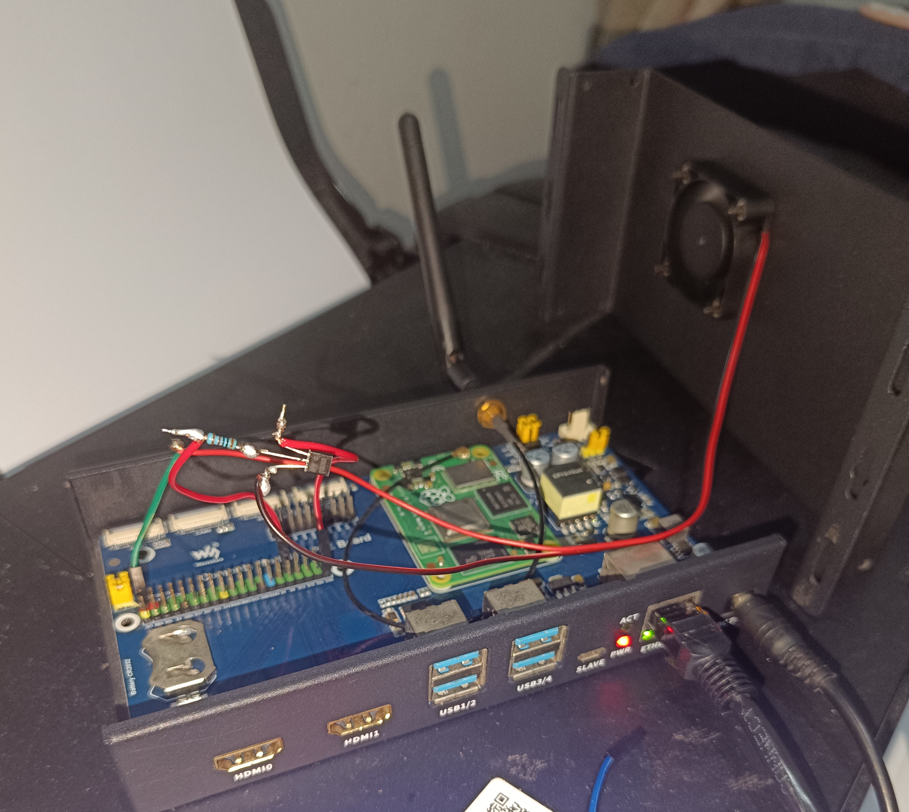

# pi-fan

这是一个树莓派调速风扇驱动。  



## 测试环境

硬件：树莓派 CM4  
系统：raspios 20240704 Debian 12  
库：WiringPi 3.10

## 材料

* S8050 三极管  

* 4010 5V 两线风扇
* 1kΩ 电阻

## 线路


PWM 接树莓派引脚 18（BCM，默认），或者接图中另外三个也可，并修改源码 [parameter.h](parameter.h) 中的 PWM 引脚定义  


## 使用

源码中设定的温度 40 起转，67 全速；CPU 占用率 50 起转，77 全速，温度和占用率取两者换算后较高的电压值控制风扇。修改请到 [main.c](main.c)  

执行下面命令安装
```bash
git clone https://github.com/IYATT-yx/pi-fan.git --depth=1
cd pi-fan
bash install.sh
```

安装后默认创建开机自启服务，并开始运行，也可以执行下面手动操作
```bash
# 启动
sudo systemctl start pi-fan.service

# 停止
sudo systemctl stop pi-fan.service

# 重启
sudo systemctl restart pi-fan.service

# 设置开机自启
sudo systemctl enable pi-fan.service

# 关闭开机自启
sudo systemctl disable pi-fan.service

# 查看状态
systemctl status pi-fan.service
```
